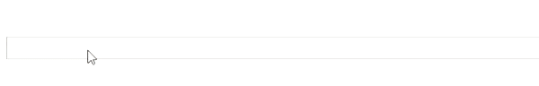

# placeholder-autocomplete
A library of placeholder autocomplete which allows you to connect to existing inputs from any library or custom ones.



## How it works
1. We split text by pair separator, e.g `from:someone key:value` and we have: `[from:someone, to:someone]`.
2. Then we split by key value separator, e.g `[from, someone], [key, value]`.
3. We take first element of a pair as a key and the second one as a value.
4. We look for most fit value in the `terms` object by accessing it's data with the key.
5. We show the placeholder behind the input with the suggestion.
<br>
* Before attaching the placeholder we copy the css from the input so it can be as much identical it can be, it might be you need to pass your custom `styles` object. 

## Docs - There is only 1 simple function
- `createPlaceholderAutocomplete` - the function which we use to create placeholder autocomplete.
it receives the following object:
    - `inputId` - id of the input element.
    - `styles` - styles object to append to the placeholder.
    its is optional to pass styles but if need you have full control of the styles. 
    - `terms` - key value object which hold key as the term key and the values as rray of values to autocomplete.
    - `onSuggestion` - fires a callback on the next suggestion key and value
<br>
For Example:
<br>

```
createPlaceholderAutocomplete({
        inputId: 'input-without-container',
        terms: {
            'from': ['georgy', 'artem', 'nandato'],
            'to': ['georgy', 'artem', 'nandato'],
        },
        onSuggestion: (obj) => {
            const {key, value} = obj;

            console.log(`key is ${key}`);
            console.log(`value is ${value}`);
        }
    });
``` 

* default pair separator: ` `(space)
* default key value separator: `:`
* default multiple values separator: `,`

# Examples
- React - https://codesandbox.io/s/material-demo-0ctk6?file=/demo.js

## TODOS/IDEAS
- [ ] async fetch term values
- [X] callback event for key,value
- [ ] allow autocomplete list also ??
    - [ ] custom
    - [ ] default list
- [ ] allow to pass custom separators
    - [ ] pair separator
    - [ ] key value separator
    - [ ] multiple values separator
- [ ] create angular example
- [X] create react example
- [ ] create vue example
- [ ] create angular example

## Issues
If you find any bug, or have anything to add or say please open an issue and i will try to solve as fast as i can;
<br>
If someone wants to help, you are more the than welcome top open pull requests :)

## License 
MIT License.
